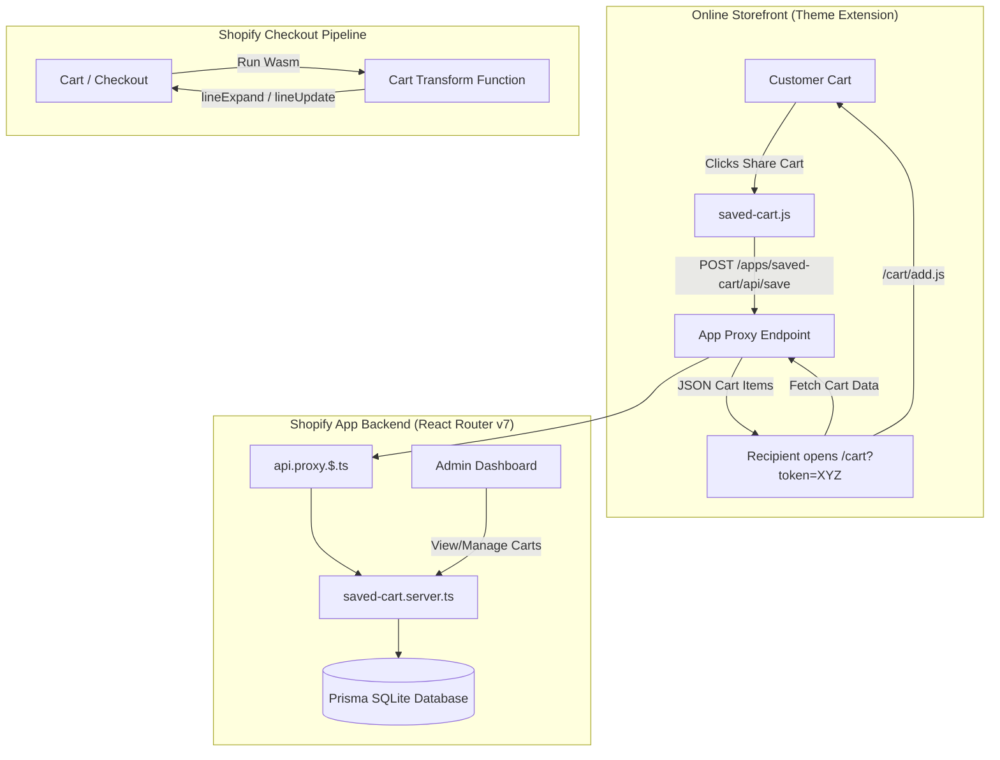

# Shopify Cart Transform & Saved Cart Platform

A production-ready Shopify application that combines a high-performance **Shopify Cart Transform Function** with an end-to-end **Saved & Shareable Cart Suite** for Online Store 2.0. Built with **React Router v7**, **Shopify App Bridge v4**, **Polaris Web Components**, **Prisma ORM**, and the **Shopify Functions (Cart Transform API)**.

---

## 📑 Table of Contents

- [Overview](#-overview)
- [Key Features](#-key-features)
  - [1. Shopify Function: Cart Transform](#1-shopify-function-cart-transform)
  - [2. Saved & Shareable Cart System](#2-saved--shareable-cart-system)
  - [3. Merchant Admin Dashboard](#3-merchant-admin-dashboard)
  - [4. Theme Setup & App Embed](#4-theme-setup--app-embed)
- [System Architecture](#-system-architecture)
- [Tech Stack](#-tech-stack)
- [Directory Structure](#-directory-structure)
- [Prerequisites](#-prerequisites)
- [Installation & Local Setup](#-installation--local-setup)
- [Activating the Cart Transform Function](#-activating-the-cart-transform-function)
- [Testing the Saved Cart on Storefront](#-testing-the-saved-cart-on-storefront)
- [Security & Best Practices](#-security--best-practices)

---

## 🌟 Overview

This application addresses two critical e-commerce challenges:
1. **Dynamic Custom Product Pricing & Bundling**: Using Shopify's latest **Cart Transform API (Wasm)**, line items with custom add-ons or configured pricing are dynamically expanded into bundles or price-adjusted in real-time during checkout with zero latency.
2. **Cart Abandonment & Cart Sharing**: Allowing customers (and guests) to snapshot their active shopping cart, generate a persistent shareable link, and restore cart contents with line item properties onto any device.

---

## 🚀 Key Features

### 1. Shopify Function: Cart Transform
- **Dynamic Bundle Expansion (`lineExpand`)**: When a line item includes custom add-on variant IDs (e.g., `_addon_variants`, `addons`), the function expands the single cart line into component child variants while preserving the parent structure.
- **Custom Unit Price Adjustment (`lineUpdate`)**: For custom product builders and pricing configurations, the function reads custom configured pricing properties (`_configured_price`, `_addon_price`) and recalculates unit prices directly within the checkout pipeline.
- **Sub-Millisecond Execution**: Compiled to WebAssembly (Wasm) via Javy to ensure lightning-fast checkout performance and reliability.

### 2. Saved & Shareable Cart System
- **Storefront App Proxy (`/apps/saved-cart/api/*`)**: Secure, authenticated communication between the storefront JavaScript client and the app backend without CORS issues.
- **One-Click Share Modal**: Generates a unique tokenized link (`/cart?token=...`) with clipboard copy functionality and instant toast notifications.
- **Auto-Restoration**: Visiting a shared link automatically populates the recipient's cart with the exact items, quantities, and line item properties.
- **Guest & Logged-in Customer Support**: Handles authenticated customer IDs, emails, and names, while supporting anonymous guest users.

### 3. Merchant Admin Dashboard
- **Real-Time KPI Metrics**: Overview cards displaying *Total Saved Carts*, *Active Carts*, *Expired Carts*, and *Saved This Week*.
- **Interactive Data Table**: Search by customer name, email, or token; filter by cart status (`all`, `active`, `expired`).
- **Detailed Cart Inspector (`/app/saved-carts/:id`)**: Comprehensive breakdown of customer metadata, items, variant IDs, unit prices, line item properties, and expiration dates.

### 4. Theme Setup & App Embed
- **Theme App Extension (OS 2.0)**: Includes both a Section App Block (`save_cart_button`) and an App Embed (`saved_cart_embed`) configurable directly in the Shopify Theme Editor.
- **In-App Integration Guide (`/app/theme-setup`)**: Detailed instructions and code snippets for merchants using classic themes or custom cart drawers.

---

## 🏗️ System Architecture



---

## 🛠️ Tech Stack

| Layer | Technology |
|---|---|
| **App Framework** | React Router v7 (`@react-router/node`, `@react-router/dev`) |
| **Frontend UI** | React 18, Shopify App Bridge v4, Polaris Web Components (`@shopify/polaris-types`) |
| **Backend & APIs** | Node.js, `@shopify/shopify-app-react-router`, GraphQL Admin API |
| **Database & ORM** | Prisma ORM, SQLite (`@prisma/client`) |
| **Shopify Functions** | Cart Transform API (Rust / TypeScript -> WebAssembly) |
| **Theme Extension** | Shopify Liquid, Vanilla JS, CSS Custom Properties |
| **Tooling & CLI** | Shopify CLI, Vite, TypeScript, ESLint |

---

## 📁 Directory Structure

```
├── app/
│   ├── routes/
│   │   ├── _index/                     # Root redirect
│   │   ├── api.proxy.$.ts              # App Proxy controller (/apps/saved-cart/api/*)
│   │   ├── app.tsx                     # Main embedded App layout & Navigation
│   │   ├── app._index.tsx              # Merchant Dashboard & Saved Carts Table
│   │   ├── app.saved-carts.$id.tsx     # Single Cart Inspector
│   │   ├── app.theme-setup.tsx         # Theme installation guide
│   │   ├── auth.$.tsx                  # OAuth authentication handler
│   │   └── webhooks.*.tsx              # Shopify compliance webhooks
│   ├── services/
│   │   └── saved-cart.server.ts        # Database operations & Business logic
│   ├── db.server.ts                    # Prisma database client instance
│   └── shopify.server.ts               # Shopify App context & Admin API client
├── extensions/
│   ├── cart-transform-function/        # Shopify Cart Transform Function
│   │   ├── src/
│   │   │   ├── cart_transform_run.ts   # Core transform logic (lineExpand & lineUpdate)
│   │   │   └── cart_transform_run.graphql # Input query definition
│   │   └── shopify.extension.toml
│   └── saved-cart-theme/               # Theme App Extension
│       ├── assets/                     # Frontend client script & styles
│       ├── blocks/                     # App blocks for theme customizer
│       ├── snippets/                   # Reusable liquid snippets
│       └── shopify.extension.toml
├── prisma/
│   ├── schema.prisma                   # Database models (Session & SavedCart)
│   └── dev.sqlite                      # Local database
├── shopify.app.toml                    # Shopify App configuration
└── package.json
```

---

## 📋 Prerequisites

Before running the application locally, ensure you have:
- **Node.js**: `v20.19+` or `v22.12+`
- **Shopify CLI**: Installed globally or executed via `npx @shopify/cli`
- **Shopify Partner Account** & a **Development Store** (with Checkout Extensibility / Shopify Plus features enabled for Functions testing)

---

## ⚙️ Installation & Local Setup

### 1. Clone the Repository
```bash
git clone <repository-url>
cd cart-transform
```

### 2. Install Dependencies
```bash
npm install
```

### 3. Initialize the Database
Generate the Prisma Client and run migrations:
```bash
npx prisma generate
npx prisma migrate deploy
```

### 4. Start the Local Development Server
```bash
npm run dev
```

When prompted:
1. Log in to your Shopify Partner account.
2. Select your development store.
3. Shopify CLI will generate a secure tunnel, configure the App Proxy URLs, and register Webhooks automatically.
4. Press `P` in the terminal to open and install the app in your development store.

---

## ⚡ Activating the Cart Transform Function

To activate the Cart Transform Function on your development store:

1. Open the **Shopify GraphiQL App** in your merchant store admin.
2. Query available Cart Transform functions to obtain your `functionId`:
   ```graphql
   query {
     shopifyFunctions(first: 10) {
       nodes {
         id
         title
         apiType
       }
     }
   }
   ```
3. Run the `cartTransformCreate` mutation to register the function:
   ```graphql
   mutation {
     cartTransformCreate(
       functionId: "YOUR_FUNCTION_ID"
       blockOnFailure: false
     ) {
       cartTransform {
         id
         functionId
       }
       userErrors {
         field
         message
       }
     }
   }
   ```

---

## 🛒 Testing the Saved Cart on Storefront

1. In the **Shopify Theme Customizer**, navigate to **App Embeds** and enable **Saved Cart Embed**, or add the **Save Cart Button** section block to your Cart Template.
2. Add products to your cart on the storefront.
3. Click **Share Cart Link** to generate a link.
4. Open the generated link in an **Incognito / Private Window**; the shared products, quantities, and line item properties will automatically load into the new session.
5. In the **Merchant Admin Dashboard**, verify that the saved cart entry appears under the **Saved Carts** table with accurate KPI metrics.

---

## 🛡️ Security & Best Practices

- **HMAC Signature Verification**: All storefront proxy requests passing through `/apps/saved-cart` are verified against Shopify's App Proxy HMAC signatures to prevent spoofing.
- **Encrypted Sessions**: Utilizes Prisma Session storage with secure token exchange compliant with Shopify Embedded App standards.
- **Type Safety**: Full TypeScript type checking across React components, server loaders/actions, and Shopify Functions code.

---

## 👨‍💻 Author

Developed by **Al Amin** as a comprehensive technical demonstration of modern Shopify App development with Shopify Functions and React Router.
